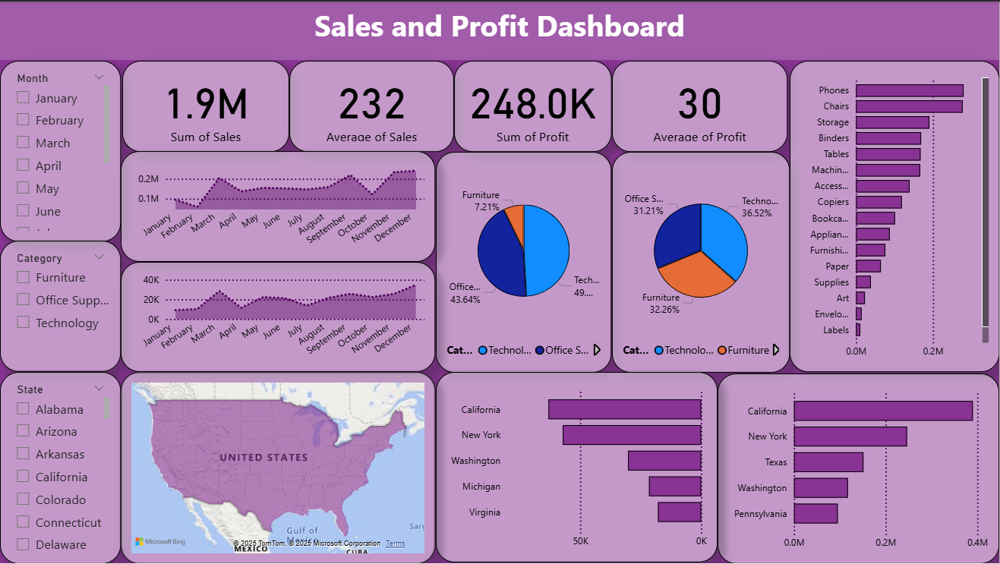

# Sales & Profit Dashboard – Performance Analysis

##  Project Overview
This Power BI dashboard analyzes sales and profit data to understand business
performance across categories, regions, and time periods.

##  Business Questions Answered
- Which categories and regions generate the highest sales and profit?
- How do sales and profit trends change over time?
- Which products contribute most to overall revenue?

##  Tools & Skills Used
- Power BI
- DAX
- Data Modeling
- Data Visualization
- Business Analytics

##  Dashboard Preview

